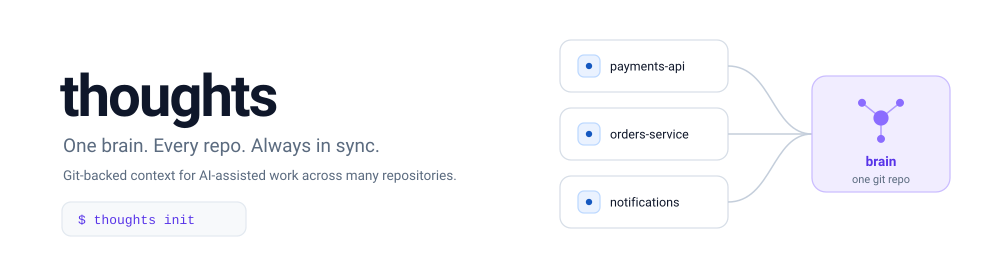
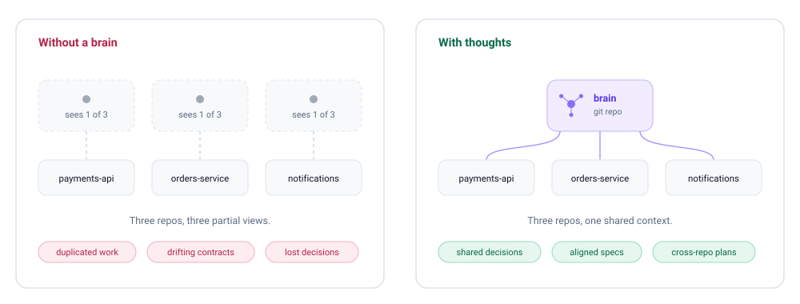
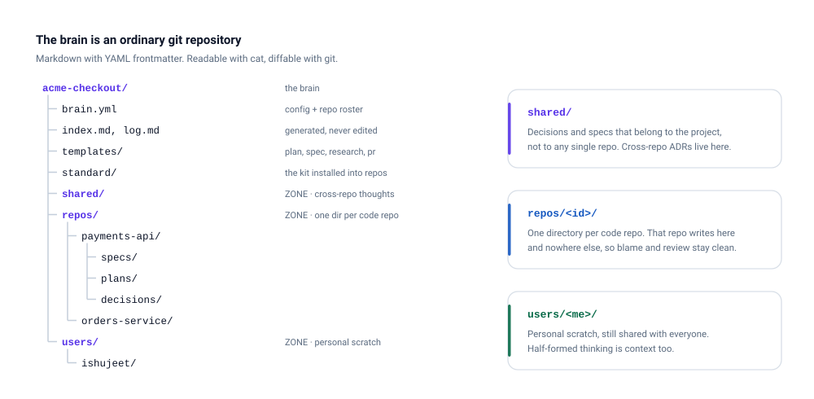
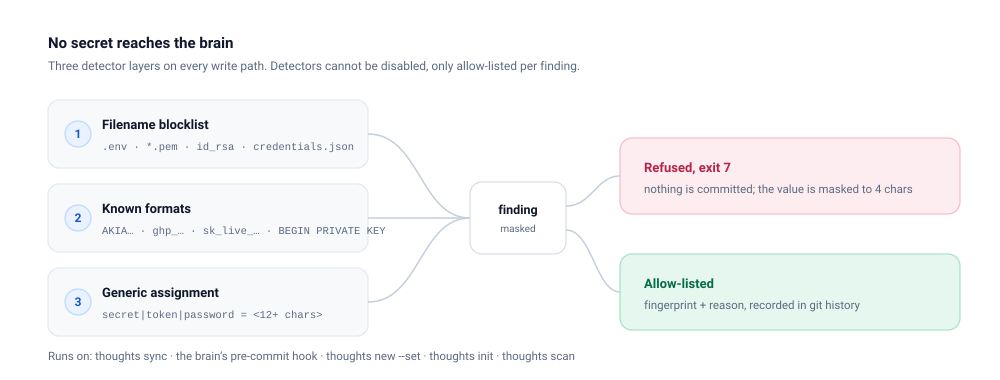
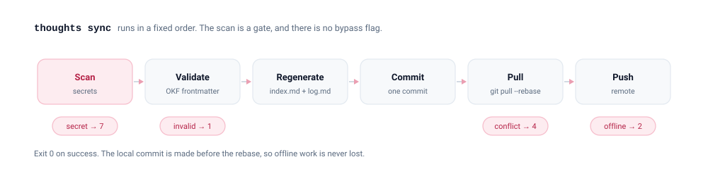

<div align="center">



[](LICENSE)
[](package.json)
[](tsconfig.json)
[](specs/12-open-decisions.md)
[](#project-status)

**`thoughts` attaches a shared, git-backed brain to every repository in a multi-repo project, so that people and their AI assistants plan, spec, research, and commit with the context of the whole system instead of one repo.**

[Why](#why) · [How it works](#how-it-works) · [Quick start](#quick-start) · [Commands](#commands) · [The brain](#the-brain) · [Secret scanning](#secret-scanning) · [Specs](#specifications)

</div>

---

## Why



AI coding assistants are excellent inside a single repository. They read the code, understand the request, and write good code with the context of everything around them.

Real projects are not a single repository. They are split into services, and each service has one or more repos. The moment a developer opens `payments-api`, both they and their assistant lose sight of:

- what `orders-service` is changing this week,
- the decision made last month about idempotency keys,
- the spec that `notifications` is building against the endpoint you are about to change,
- which tickets are in flight, and which repos they touch.

That context lives in people's heads, in chat, or in a wiki nobody updates. Services drift, work gets duplicated, and integration surprises land late.

`thoughts` gives the project one **brain**: a plain git repository holding plans, specs, research, and decisions, attached to every repo and readable by every tool.

## How it works

**1. One brain per project.** An ordinary git repository, nothing more. Markdown with YAML frontmatter, organised per the [Open Knowledge Format](https://github.com/GoogleCloudPlatform/knowledge-catalog/blob/main/okf/SPEC.md). No server, no database, no account.

**2. `thoughts init` in each code repo.** It symlinks the whole brain at `<repo>/thoughts`, so every repo's thinking is readable from every other repo. It installs a small kit of slash commands, and it inserts a managed block into `CLAUDE.md` (or `AGENTS.md`) that tells the assistant to read and write the brain at the right moments. Your own content in those files is never touched.

**3. Everyone stays aligned.** Assistants create documents with `thoughts new`, search across repos, and run `thoughts sync` to pull in what other teams wrote and push what they wrote. Indexes regenerate themselves. Secrets are refused at every write path.

```console
$ cd payments-api
$ thoughts init --yes --brain git@github.com:acme/acme-brain.git
$ ls thoughts/repos
notifications  orders-service  payments-api
```

The brain is a symlink, and it is gitignored. Nothing about how your repo builds, tests, or ships changes.

## Quick start

### Requirements

| | |
|---|---|
| Node.js | 22 or newer |
| git | on `PATH` |
| OS | macOS or Linux |

### Install

Not published to npm yet. Install from source:

```bash
git clone https://github.com/Ishujeet/thoughts.git
cd thoughts
npm install
npm run build
npm link          # puts `thoughts` on your PATH
```

### Attach your first repo

```bash
cd ~/code/payments-api

# Point at an existing brain, or create one at a local path.
thoughts init --yes --brain ~/code/acme-brain

# Write something.
thoughts new spec "Refund endpoint v2"
$EDITOR thoughts/repos/payments-api/specs/2026-09-11-refund-endpoint-v2.md

# Share it.
thoughts sync
```

Now do the same in the next repo. Its `thoughts/` symlink shows the spec you just wrote.

## Commands

| Command | What it does | Status |
|---|---|---|
| [`thoughts init`](specs/02-cli-init.md) | Attach this repo to a brain and install the standard kit | Shipped, non-interactive |
| [`thoughts sync`](specs/03-cli-sync.md) | Scan, validate, regenerate indexes, commit, pull, push | Shipped |
| [`thoughts new`](specs/06-cli-new.md) | Create a thought from a template in the right zone | Shipped |
| [`thoughts scan`](specs/15-secret-scanning.md) | Scan the brain for secrets | Shipped, core subset |
| [`thoughts status`](specs/04-cli-status.md) | Show what is in flight across every repo | Specified, not built |
| [`thoughts search`](specs/05-cli-search.md) | Search thoughts across all repos | Specified, not built |
| [`thoughts attach-all`](specs/13-cli-attach-all.md) | Clone and attach every repo in the brain | Specified, not built |
| [`thoughts worktree`](specs/14-cli-worktree.md) | Git worktrees with the brain symlink in place | Specified, not built |

<details>
<summary><b><code>thoughts init</code></b>: attach a repo</summary>

```
thoughts init [--brain <url|id|path>] [--repo-id <id>] [--tools claude-code,codex,pi]
              [--templates builtin|brain|path:<dir>|git:<url>] [--skills all|none|<name,...>]
              [--no-agents] [--no-commands] [-y|--yes] [--force] [--dry-run] [--json]
```

Resolves or creates the brain, registers this repo in `brain.yml`, creates the `thoughts` symlink, gitignores it, writes `.thoughts.yml`, installs the kit, inserts the managed block, and runs an initial sync. Re-running is safe: it reports drift instead of redoing work.

A repo whose `.thoughts.yml` is committed but which you have never initialised on this machine is **attached, not initialised**. Every other command refuses with exit 5 and tells you to run `thoughts init`.

The interactive guide is not built yet. Use `--yes` with flags.

</details>

<details>
<summary><b><code>thoughts sync</code></b>: share and receive</summary>

```
thoughts sync [--pull-only|--push-only] [-m <msg>] [--no-push] [--allow-invalid]
              [--brain <id|url>] [--json] [-q|--quiet]
```

Validates and commits your brain changes, rebases on the remote, pushes, and reports what arrived from other repos. Conflicts in generated files resolve themselves. Conflicts in real content stop with exit 4 and the file named.

</details>

<details>
<summary><b><code>thoughts new</code></b>: create a thought</summary>

```
thoughts new <kind> [title] [--shared|--repo <id>|--user] [--template <path>]
             [--set key=value]... [--from <path>] [--open] [--json]
```

Kinds are `plan`, `spec`, `research`, `decision`, `pr`, and `commit`. The file lands in the right zone with valid frontmatter, `status: draft`, and a dated slug. `--from` links an existing thought as a source, which is how a plan becomes a PR description.

</details>

<details>
<summary><b><code>thoughts scan</code></b>: check for secrets</summary>

```
thoughts scan [--staged] [--brain <id|url>] [--json]
```

Runs the detectors over the whole brain, or only staged files when called from the brain's pre-commit hook. `--history`, `--fix`, and `--allow` are specified but not built.

</details>

## The brain



Three **zones**, and every thought lives in exactly one:

- **`shared/`** for anything that belongs to the project rather than one repo. Cross-repo decisions go here, not into both repos.
- **`repos/<id>/`** for a single code repo. Its assistant writes here and nowhere else, which keeps blame, review, and conflicts tractable.
- **`users/<me>/`** for personal scratch. It still syncs, because half-formed thinking is context too.

Inside each zone, documents are grouped by **kind**: `plans`, `specs`, `research`, `decisions`, `prs`.

### Anatomy of a thought

Every document is an [OKF](https://github.com/GoogleCloudPlatform/knowledge-catalog/blob/main/okf/SPEC.md) concept: markdown with YAML frontmatter that any tool, script, or human can read.

```markdown
---
type: Spec
title: Refund endpoint v2
description: Adds a v2 refund API with idempotency keys.
status: draft                  # draft | stable | deprecated
tags: [payments, api]
repo: payments-api
generated:
  by: claude-code/claude-fable-5-1
  at: 2026-09-11T10:12:00Z
verified:
  - by: human:ishujeet         # this is what makes it "human-reviewed"
    at: 2026-09-11T14:02:00Z
sources:
  - resource: /shared/decisions/2026-09-01-idempotency-key-format.md
links:
  ticket: CHK-142
  pr: acme/payments-api#88
---

## Summary
...
```

`index.md` and `log.md` are generated from that frontmatter on every sync. You never edit them by hand.

## Secret scanning



The brain is cloned to every machine and fed to every assistant. A key that lands there is copied everywhere and is very hard to recall, so `thoughts` refuses it at the source.

- **Three detector layers**: a filename blocklist, a table of known key formats for the major providers, and a generic assignment pattern that ignores placeholders such as `${TOKEN}` and `<your-key-here>`. An entropy check is available and off by default.
- **No bypass flag.** A finding stops the write. False positives are allow-listed one at a time by fingerprint, with a recorded reason and author, which is itself a reviewed change in git history.
- **Never printed.** Matched values are masked to their first four characters everywhere, including logs and error messages.
- **Every write path**: `sync`, the brain's own pre-commit hook, `new --set`, the config files `init` writes, and `scan` on demand.

If something did get pushed, rotate it first. Scanning does not un-leak a credential.

## The sync pipeline



| Exit | Meaning |
|---|---|
| `0` | Success, including no-op re-runs |
| `1` | Validation error, bad flags, or user abort |
| `2` | Brain remote unreachable. A local commit may still exist |
| `3` | Filesystem conflict, such as an existing `thoughts/` path |
| `4` | Git conflict that needs manual resolution |
| `5` | Repo is attached but not initialised on this machine |
| `7` | A secret was found. Nothing was written or committed |

## Configuration

Three files, all plain YAML.

| File | Committed | Holds |
|---|---|---|
| `~/.config/thoughts/config.yml` | no | Known brains, your user id, which repos you have initialised |
| `<repo>/.thoughts.yml` | yes | Which brain this repo belongs to, its id, the tools the team uses |
| `<brain>/brain.yml` | yes | Project name, repo roster, kinds, template source, integrations |

```yaml
# <repo>/.thoughts.yml
brain: git@github.com:acme/acme-brain.git
repo_id: payments-api
tools: [claude-code, codex]
kit_version: 0.1.0
```

```yaml
# <brain>/brain.yml
okf_version: "0.2"
kind: project
name: acme-checkout
repos:
  - id: payments-api
    remote: git@github.com:acme/payments-api.git
  - id: orders-service
    remote: git@github.com:acme/orders-service.git
templates:
  source: builtin        # builtin | brain | path:<dir> | git:<url>
security:
  entropy: false
```

## Templates and the standard kit

**Templates** shape each kind of document: `plan`, `spec`, `research`, `decision`, `pr`, and `commit`. The built-in set ships with the CLI. An organisation can override any of them at the brain level, so every repo produces the same shape of document. There are deliberately no per-repo overrides.

Templates are Handlebars, restricted to substitution, `if`, `each`, and a small helper list, so they stay readable as plain markdown by someone who has never seen this tool.

**The standard kit** is what `init` installs into a code repo:

| Part | Where it goes | What it does |
|---|---|---|
| Instruction block | `CLAUDE.md`, `AGENTS.md` | Tells the assistant to read the brain, where to write, and never to write secrets |
| Commands | `.claude/commands/thoughts-*.md` | `/thoughts-plan`, `/thoughts-spec`, `/thoughts-research`, `/thoughts-decide`, `/thoughts-commit`, `/thoughts-pr`, `/thoughts-status`, `/thoughts-sync` |
| Skills | `.claude/skills/` | Cross-repo impact analysis, ADR writing, spec review, brain hygiene |
| Agents | `.claude/agents/` | A read-only researcher and a scoped writer |

The instruction block lives between `thoughts:begin` and `thoughts:end` markers. Everything outside them is yours and is preserved byte for byte.

## Project status

Alpha. Version 0.1.0, built spec-first, not yet published.

**Milestone 1 is complete and verified**: 26 test files, 257 tests passing, typecheck and build clean. A coverage audit against the specs found 143 acceptance criteria implemented and tested, 8 implemented without a test, 13 stubbed behind explicit TODOs, and none missing.

| Works today | Specified, not built yet |
|---|---|
| The brain layout, config chain, OKF parsing and validation | `status`, `search`, `attach-all`, `worktree` |
| Generated `index.md` and `log.md`, lint rules | The interactive `init` guide and per-tool sub-guides |
| `init` non-interactive, `sync`, `new`, `scan` | Skills and agents install, codex and pi adapters |
| The secret scanner and its git hook | GitHub, Azure DevOps, and Jira integrations |
| Handlebars templates, the claude-code adapter | `sync --watch`, brain hooks, `scan --history/--fix/--allow` |
| | The SQLite search index |

Roadmap is the [specs](specs/README.md) themselves, in numeric order, plus the decision log in [12-open-decisions.md](specs/12-open-decisions.md).

## Specifications

Specs are the source of truth. Code follows them, and when the two disagree, one of them is fixed in the same change.

| # | Spec | Covers |
|---|---|---|
| 00 | [Overview](specs/00-overview.md) | Problem, goals, non-goals, glossary, principles |
| 01 | [Brain repository](specs/01-brain-repo.md) | Layout, zones, config, symlink, org-level hook |
| 02 | [`init`](specs/02-cli-init.md) | Attaching a repo, the kit, attached-not-initialised |
| 03 | [`sync`](specs/03-cli-sync.md) | The pipeline, conflicts, exit codes |
| 04 | [`status`](specs/04-cli-status.md) | What is in flight across the project |
| 05 | [`search`](specs/05-cli-search.md) | grep and SQLite backends behind one interface |
| 06 | [`new`](specs/06-cli-new.md) | Creating documents from templates |
| 07 | [Templates](specs/07-templates.md) | The six built-ins and the Handlebars subset |
| 08 | [Standard kit](specs/08-standard-kit.md) | Instructions, commands, skills, agents |
| 09 | [Index and metadata](specs/09-index-metadata-okf.md) | OKF fields, trust tiers, generated files |
| 10 | [Integrations](specs/10-integrations.md) | GitHub, Azure DevOps, Jira |
| 11 | [AI tool adapters](specs/11-ai-tool-adapters.md) | claude-code, codex, pi |
| 12 | [Decisions](specs/12-open-decisions.md) | The decision log and what is still open |
| 13 | [`attach-all`](specs/13-cli-attach-all.md) | Bootstrapping a whole project on a new machine |
| 14 | [`worktree`](specs/14-cli-worktree.md) | Several features at once on one repo |
| 15 | [Secret scanning](specs/15-secret-scanning.md) | Detectors, allow-listing, recovery |

## Development

```bash
npm install
npm run typecheck     # tsc --noEmit, strict
npm test              # vitest
npm run check         # both
npm run build         # dist/, with an executable bin
```

Source layout:

```
src/
├── brain/        layout, config chain, OKF parse and validate, index generation, lint
├── security/     the secret scanner: blocklist, patterns, allow-list, masking
├── commands/     init, sync, new, scan
├── templates/    resolution and the restricted Handlebars renderer
├── adapters/     managed block, the claude-code adapter, kit install
└── types.ts      shared types, exit codes, error classes
```

## Contributing

1. **Spec first.** New behaviour gets a spec, or a spec change, before code.
2. Keep the vocabulary in the [glossary](specs/00-overview.md). Brain, thought, zone, kind, adapter, kit.
3. Anything written into a brain must stay OKF compliant.
4. Never break the host repo. Everything `init` installs is additive, mergeable, and gitignored where appropriate.
5. Never print a matched secret unmasked, not even in a test fixture.

See [CLAUDE.md](CLAUDE.md) for how these rules are enforced during AI-assisted development of this repo itself.

## License

[Apache License 2.0](LICENSE). See [NOTICE](NOTICE) for attribution.

```
Copyright 2026 Ishujeet Panjeta

Licensed under the Apache License, Version 2.0 (the "License");
you may not use this file except in compliance with the License.
You may obtain a copy of the License at

    http://www.apache.org/licenses/LICENSE-2.0
```
